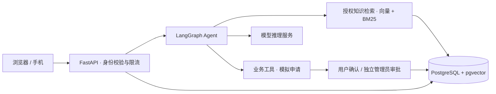

# Service Desk Agent · 智能服务台

[](https://github.com/yyyj123/service-desk-agent/actions/workflows/ci.yml)
[](LICENSE)

基于 **FastAPI + LangGraph** 的服务台 Agent：先检索授权知识库，再回答问题或提出需要确认的操作申请。

这是可运行、可测试的工程演示项目。业务工具均为模拟，尚未接入真实企业身份或工单系统，不宣称已经达到企业生产验收标准。

## 功能

- **ReAct Agent**：知识检索、模拟服务状态、密码重置申请、资源权限申请、工单申请，共 5 个工具。
- **RAG**：中文递归切片、向量检索 + BM25 + RRF，可选重排；未命中时明确标注通用建议。
- **权限与审批**：JWT、会话撤销、Cookie/CSRF、租户和角色过滤、独立审批、幂等与 HMAC 审计。
- **知识管理**：支持 TXT、MD、CSV、HTML、DOCX、XLSX、PPTX、文本 PDF，含版本检查与失败回滚。
- **异常恢复**：SSE 流式回答、断线恢复、问答并发保护、滑动窗口限流、登录和入库容量控制。
- **界面**：员工咨询与申请，管理员审批、知识库、审计与统计；手机端左侧抽屉导航。
- **部署**：本机 SQLite/Chroma 或 PostgreSQL/pgvector，提供 Docker、监控和云构建导出。

## 架构



模型和 Embedding 由你配置，可使用兼容接口的外部服务或私有模型。外部服务可能接收问题、对话上下文和检索片段，请按自己的数据要求选择部署方式。

## 快速开始

推荐 **Python 3.10**，与锁文件和 CI 的验证环境一致。

```bash
git clone https://github.com/yyyj123/service-desk-agent.git
cd service-desk-agent
python -m venv .venv
```

激活环境：Windows PowerShell 使用 `.\.venv\Scripts\Activate.ps1`；Linux/macOS 使用 `source .venv/bin/activate`。

```bash
python -m pip install -r requirements-enterprise.lock.txt
python -c "from pathlib import Path; p=Path('.env'); p.exists() or p.write_bytes(Path('.env.example').read_bytes())"
```

编辑 `.env`，填写自己的 `IT_CHAT_KEY`、`IT_EMBED_KEY`，确认接口地址及模型名称，然后运行：

```bash
python -m service.manage init
python -m service.manage ingest
python -m service.manage serve
```

访问 **http://127.0.0.1:8600**。随机生成的员工和管理员密码在 `runtime/accounts.txt`，JWT 和指标密钥在 `.env.enterprise`，这些文件不会被 Git 跟踪。

不要预先复制 `.env.enterprise.example`：`init` 会生成实际密钥。仅供演示时，可在 `.env.enterprise` 添加 `IT_DEMO_LOGIN=true`，在登录页显示试用账号。

## PostgreSQL / pgvector

首次初始化前，在 `.env` 设置自己的 `DATABASE_URL`，并确保数据库允许启用 `vector` 扩展。随后使用同样的 `init`、`ingest` 和 `serve` 命令。

用户、会话、审批、审计和知识向量一起保存在 PostgreSQL。切换存储后端不会自动迁移旧数据。

## Docker

先按上文配置 `.env` 并执行本机 `init`，生成 `.env.enterprise` 和指标密钥，再运行：

```bash
docker compose build
docker compose run --rm app python -m service.manage init
docker compose run --rm app python -m service.manage ingest
docker compose up -d
docker compose --profile monitoring up -d
```

应用 8600 端口、Prometheus 9090 端口默认只绑定本机。SQLite/Chroma 数据使用 `it_state` 命名卷；不要用 `docker compose down -v` 删除需要保留的数据。

## 云构建导出

```bash
python scripts/prepare_cloud.py ../service-desk-build
```

导出新的构建目录，生成带内容哈希的前端文件和云端依赖锁文件，不复制 `.env` 或运行数据。通过自己的云平台部署该目录。

云端须配置：`DATABASE_URL`、`IT_JWT_SECRET`、`IT_METRICS_TOKEN`、模型相关变量、`CLOUD_DEMO_EMPLOYEE_PASSWORD`、`CLOUD_DEMO_ADMIN_PASSWORD` 和 `IT_ORIGIN`。HTTPS 设置 `IT_COOKIE_SECURE=true`。此入口仍创建模拟账号；企业正式使用需替换身份接入。

## 测试与边界

```bash
python -m pytest -q
```

共 47 项后端测试，未配置专用 PostgreSQL 测试库时跳过 6 项。配置方法和评估范围见 [测试说明](docs/TESTING.md)。

默认全局最多 4 个活跃问答，每账号 60 请求/分钟，每进程最多 2 次密码校验和 1 次文档入库。短写事务使用共享锁保证一致性，向量采用精确扫描；不承诺大规模吞吐、长期可用性或合规认证。

## 目录

- `service/`：API、Agent、检索、存储、文档解析与安全控制。
- `portal/`：无前端构建依赖的浏览器界面。
- `knowledge/`：虚构演示制度，不代表真实公司政策。
- `tests/`：单元与集成测试。
- `deploy/`：云入口、反向代理与监控示例。
- `scripts/`：构建导出及检索评估。

[MIT 许可证](LICENSE) · [安全说明](SECURITY.md) · [贡献指南](CONTRIBUTING.md)
